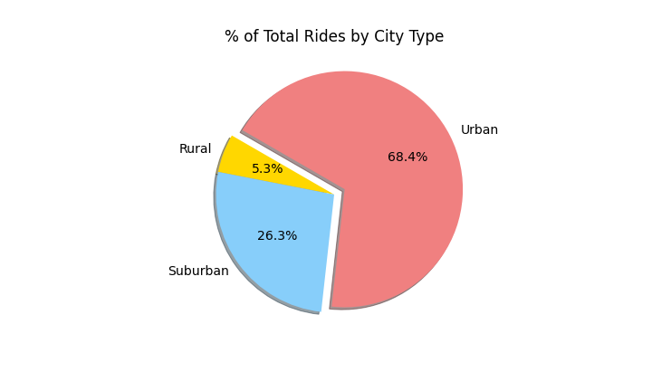

# PyBer_Analysis

## Project Overview

The purpose of this analysis was to provide PyBer with:
-	A summary DataFrame of the ride-sharing data by city type
-	Includes: Total rides, drivers and fares
-	Includes: Average fare per ride and driver
-	A multiple-line graph showing total weekly fares for each city type

## Results

The ride-sharing summary showed:

-	Urabn cities had more rides with a lower average fare and rural cities had the least amount of rides with the most expensive average fare. (Circle size correlates to number of drivers in each city)

-	Rural cities have the least amount or rides (125) and drivers (78)
-	Urban cities have the greatest number of rides (1,625) and drivers (2,405)
-	Rural cities have the highest average fare per rider ($35) and driver ($55)
-	Urban cities have the lowest average fare per rider ($25) and driver ($17)
-	Rural had the lowest total fares amount ($4,300)
-	Urban cities had the highest total fare amount ($40,000)

-	The following pie charts show the percent of total fares, rides and drivers by city types 
-	The results have showed that urban cities have the largest percent of total fares, rides and drivers 

-	The line chart below shows the total fare by city type from January to May in 2019
-	The chart trends can explain/ be explained by:
	-	When different cities tend to use PyBer (Suburban cities usage increases close to the Spring)
	-	Urban fares are overall higher, may be due to higher population
	

## Summary

Using the ride-sharing summary and multiple line graph I believe PyBer could take the approaches recommended below to adjust the disparities.

-	There appears to be a large decrease in total fares in May and low total fares in January.  I recommend decreasing the cost per ride or giving incentives during this time to increase usage of PyBer.

-	With Rural cities having the highest average fare, but lowest rides and drivers.  I recommend creating incentives to increase the driver amount, like bonuses or higher pay.  I also recommend having longer flash sale periods to increase usage of Pyber.
	 
-	All three city types have ride amounts that appear low in comparison to the amount of drivers.  I recommend creating incentives to increase total rides overall.  Deals for the consumer or coupons through third party partners like PyBer eats.

## Resources
- Data Source: city_data.csv, ride_data.csv
- Software: Python 3.7, Jupyter Notebook, Pandas library, Mtplotlib.pyplot library, and Numpy library

